# ASIC Design

<details>
<summary>DAY-0</summary>
<br>


### Icarus Verilog Installation

**Steps to install Icarus Verilog**
```
sudo apt-get install iverilog
```


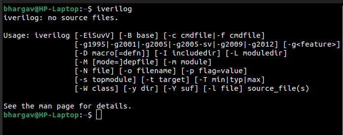


iverilog tool installed

### Yosys Installation

**Steps to install Yosys**

```
git clone https://github.com/YosysHQ/yosys.git
cd yosys 
sudo apt install make (If make is not installed please install it) 
sudo apt-get install build-essential clang bison flex \
    libreadline-dev gawk tcl-dev libffi-dev git \
    graphviz xdot pkg-config python3 libboost-system-dev \
    libboost-python-dev libboost-filesystem-dev zlib1g-dev
make config-gcc
make 
sudo make install
```

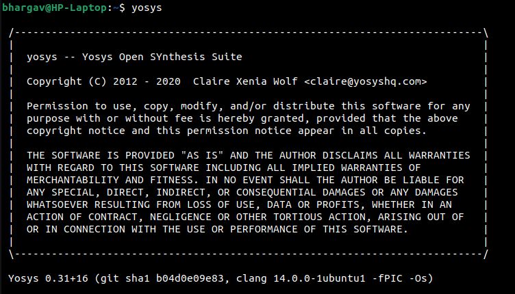

Yosys installed


### Gtkwave Installation

**Steps to install Gtkwave**
```
sudo apt update
sudo apt install gtkwave
```

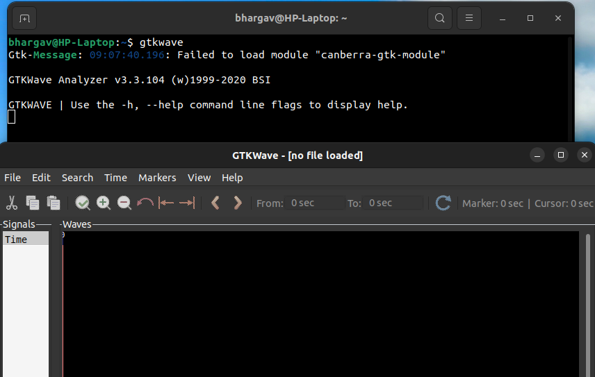

gtkwave installed

### Ngspice installation
**Steps to install ngspice**
```
wget https://sourceforge.net/projects/ngspice/files/ngspice-40.tar.gz
tar -zxvf ngspice-40.tar.gz
cd ngspice-40
mkdir release
cd release
sudo apt install automake libtool libxaw7-dev flex bison libncurses5-dev
../configure  --with-x --with-readline=yes --disable-debug
make
sudo make install
```
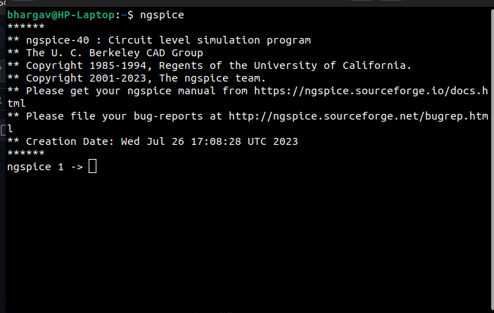

ngspice installed

### OpenSTA Installtion
**Steps to install OpenSTA**
```
git clone https://github.com/The-OpenROAD-Project/OpenSTA.git
cd OpenSTA
mkdir build
cd build
sudo apt-get install cmake clang gcctcl swig bison flex
cmake ..
make
```
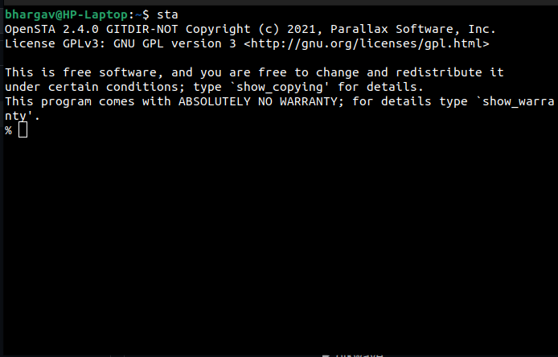

Note: Additional step of storing path of openSTA executable file in environment variables is done for easy access in terminal

Open STA installed

### Magic tool installation
**steps to install magic layout tool**
```
sudo apt-get install m4
sudo apt-get install tcsh
sudo apt-get install csh
sudo apt-get install libx11-dev
sudo apt-get install tcl-dev tk-dev
sudo apt-get install libcairo2-dev
sudo apt-get install mesa-common-dev libglu1-mesa-dev
sudo apt-get install libncurses-dev
git clone https://github.com/RTimothyEdwards/magic
cd magic-master
./configure
make
make install
sudo apt install magic
```

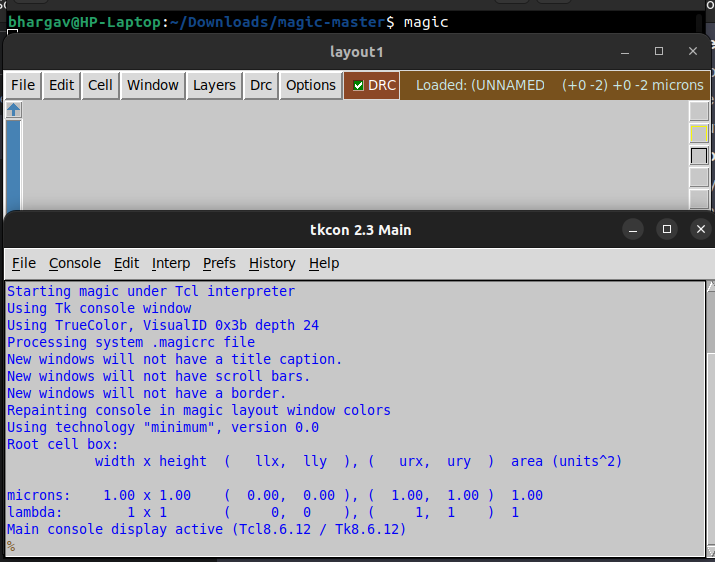

Magic tool installed
</details>

<details>
<summary>DAY-1</summary>
<br>

### Overview
This session is about steps followed to compile and simulate verilog design and testbench codes using iverilog tool. This section also deals with graphical waveform viewer tool called gtkwave and synthesis tool called yosys and its steps to produce netlist from design file.

### Sample Verilog simulation
This session takes an example of 2x1 multiplexer (verilog design and test bench) to demonstrate iverilog compilation and gtkwave waveform viewer. 

The verilog codes are taken from github repository: https://github.com/kunalg123/sky130RTLDesignAndSynthesisWorkshop.git


Following is syntax for compilation and execution of verilog codes to generation outputs.
```
iverilog designfile.v testbench.v
./aout
gtkwave vcdfile.vcd
```


Below represents sample design verilog codes.

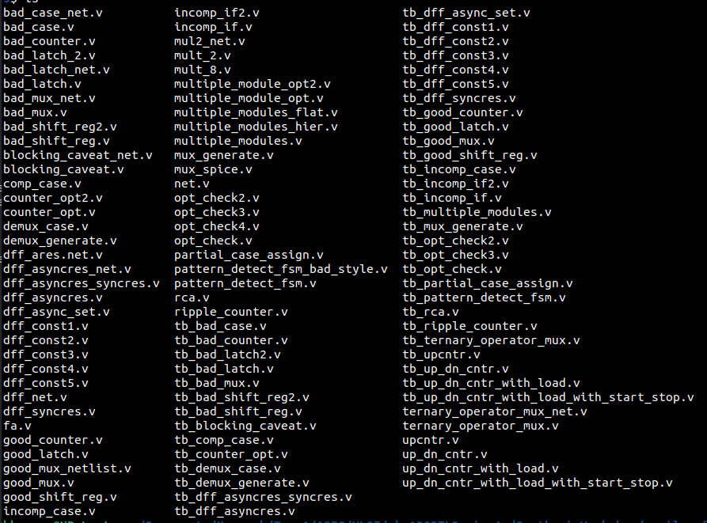


Below represent simulation output of 2x1 multiplexer design.

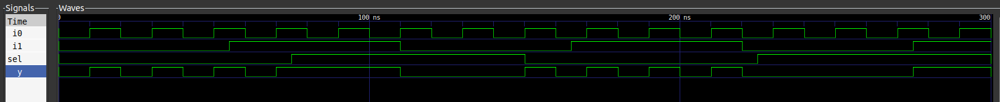


### Yosys synthesis process
This section explains the concept of yosys library cells and process of generating netlist using yosys tool. The library contains variety of cells with various operating speeds for different applications and avoid violations. 

Following represents various commands used to generate netlist for given design.

```
yosys> read_liberty -lib <path to lib file>
yosys> read_verilog <path to verilog file>
yosys> synth -top <top_module_name>
yosys> abc -liberty <path to lib file>
yosys> show
yosys> write_verilog <file_name_netlist.v>
yosys> write_verilog -noattr <file_name_netlist.v>
```


Below represents schematic represented by yosys tool for given design.
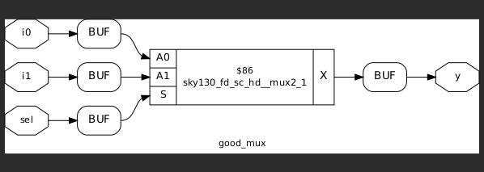


Below represents netlist represented by yosys tool for given design.
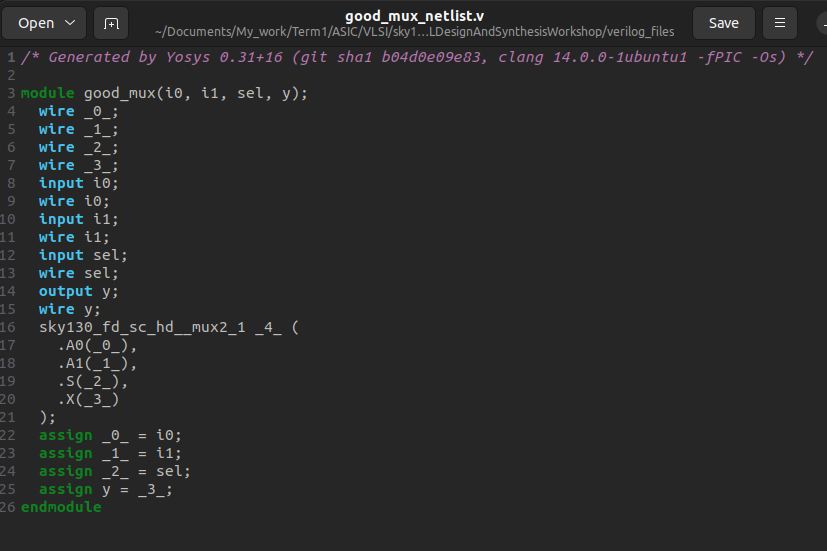


</details>


<details>
<summary>DAY-2</summary>

### Overview
This section describes basic understanding of lib technology file and its important aspects. This section also explains hierarchy and flat synthesis implementation of multiple modules.

### Verilog modules
The verilog codes are taken from github repository: https://github.com/kunalg123/sky130RTLDesignAndSynthesisWorkshop.git

The verilog codes considered are multiple_moudules.v

### Sample Synthesis of multiple modules
This section explains the sample synthesis process involved in multiple modules rather than single module. The previously discussed yosys commands are used to execute synthesis process with respective parameters for two types of designs. They are hierarchy and flat designs. 

```
yosys> read_liberty -lib <path to lib file>
yosys> read_verilog <path to verilog file>
yosys> synth -top <top_module_name>
yosys> abc -liberty <path to lib file>
yosys> flatten
yosys> show
yosys> write_verilog -noattr <file_name_netlist.v>
```

Following represents schematic netlist of hierarchy design.
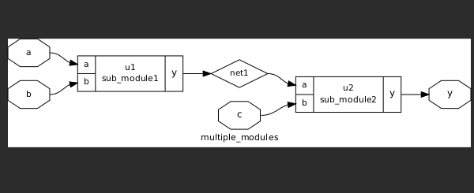
 
Following represents schematic netlist of flat design.
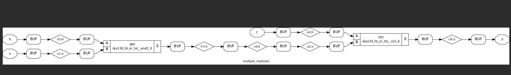


### Sample synthesis of submodules
In this section, we learn about synthesis process of submodules and generating corrspnding netlist.

We follow the similar steps as decribed previously with small change in synthesis command i.e we specify the subodule name we are interested and apply steps similar to we have seen previosuly till netlist generation.
```
yosys> read_liberty -lib <path to lib file>
yosys> read_verilog <path to verilog file>
synth -top <submodule_name>
yosys> abc -liberty <path to lib file>
yosys> show
yosys> write_verilog -noattr <file_name_netlist.v>
```

Following represents synthesis schematic of two submodules defined in main design file.
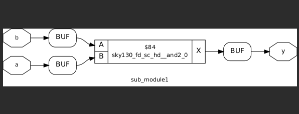

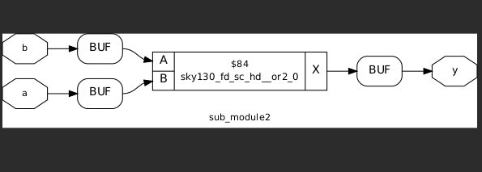

We prefer to synthesize submodules separately due to various reasons such as inefficient synthesis carried out if done with entire module, if design contains replica of sub modules, we would like to synthesize once and combine together in main module.

### Coding styles
This section explains about various coding styles. 

Usually, in a digital circuit, we encounter an issue called as glitch. This is due to propagation delay associated with gates in circuit. To resolve this issue, we use D flip flop in between combinational circuits to hold the stable value and prevent it from disturbing next stage until positive edge of clock occurs. Hence, we want a particular value to occur initially. This is achieved through synchronous or asynchronous reset signals.

Following represents asynchronous reset signal in action.
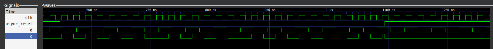

Following represents asynchronous set signal in action.
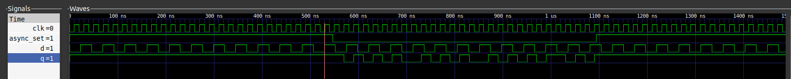
 
Following represents synchronous reset signal in action.


### Synthesis of Flop circuits
This section explains steps to be followed in synthesis of circuits containing flop modules and its commands.

These include an additional step specifically for FF designs to pick library cells specific to them. 
```
yosys> read_liberty -lib <path to lib file>
yosys> read_verilog <path to verilog file>
yosys> synth -top <top_module_name>
yosys> dfflibmap -liberty <path to lib file>
yosys> abc -liberty <path to lib file>
yosys> show
yosys> write_verilog <file_name_netlist.v>
yosys> write_verilog -noattr <file_name_netlist.v>
```

Following represents asynchronous reset signal in action.


Following represents asynchronous set signal in action.

 
Following represents synchronous reset signal in action.


</details>

<details>
<summary>DAY-3</summary>


</details>

<details>
<summary>REFERENCES</summary>

    
https://steveicarus.github.io/iverilog/

https://yosyshq.net/yosys/

https://gtkwave.sourceforge.net/

https://ngspice.sourceforge.io/

https://github.com/The-OpenROAD-Project/OpenSTA

http://opencircuitdesign.com/magic/

https://github.com/kunalg123/sky130RTLDesignAndSynthesisWorkshop.git

</details>
